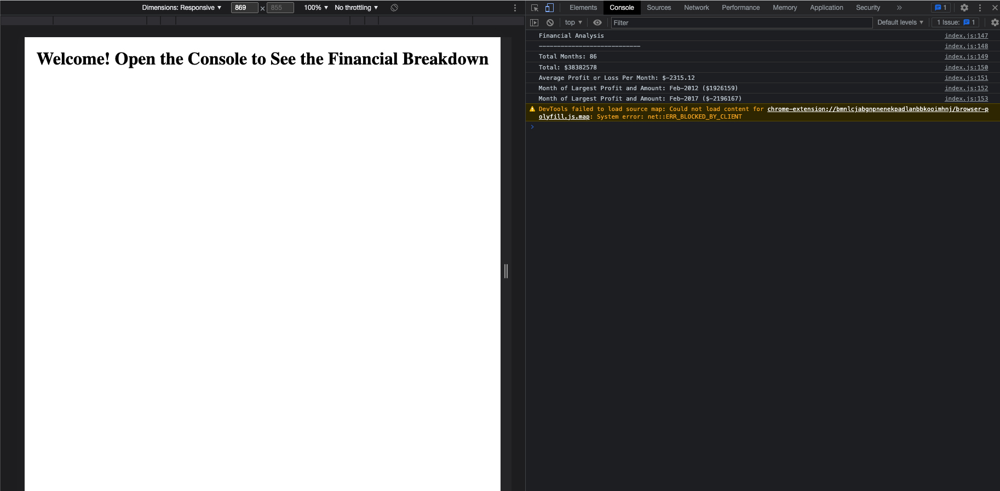
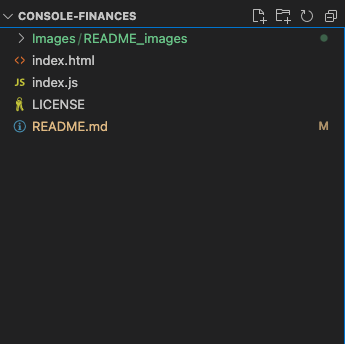

# Console-Finances

## Description 

This is a Student Portfolio Project for Bootcamp course with EDx using Bootstrap. This Pge contains Javascript compontents to analyse the financial records of a company

* Task 1 - The total number of months included in the dataset.
* Task 2 - The net total amount of Profit/Losses over the entire period.
* Task 3 - The average of the changes in Profit/Losses over the entire period.
* Task 4 - The greatest increase in profits (date and amount) over the entire period.
* Task 5 - The greatest decrease in losses (date and amount) over the entire period.

Final code should print the analysis within the console.

https://tjhandson.github.io/Console-Finances/

## Installation

# Web browser - Chrome
To View the finished webpage downloading a Web browser, such as google chrome, is recomended. Please find the link too download below: https://www.google.co.uk/chrome/?brand=YTUH&gclid=EAIaIQobChMI5pKQxIr2-wIVwp7tCh3CoA27EAAYASAAEgI4jfD_BwE&gclsrc=aw.ds

With the instalation process noted below: https://support.google.com/chrome/answer/95346?hl=en-GB&co=GENIE.Platform%3DDesktop

# Git 
It is recomented to download Git if you are looking to interact with this public repo, Details on downloading this can be found here: https://github.com/git-guides/install-git

# VS Code
Visual Studio Code is a source-code editor (there are others available), The download for this cn be found on; https://code.visualstudio.com/download

# Usage 
This is a public repo and available to be run on either a webrowser or locally. 

## Run on Wb browser (Chrome recommented for acccess to Console)
Follow the link on: https://tjhandson.github.io/Console-Finances/

To access the console in Chrome Browser use this keyboard shortcut: "Cmd + Option + J" (on a Mac) or "Ctrl +Shift +J" (on Windows). 
However, alternatively right-click on the webpage and click "Inspect" to open the developer console and slecet the "Console" tab within this tab

## Run Locally 

Clone project
git clone git@github.com:tjhandson/Console-Finances.git

Once downloaded the follow assets should be available within this folder:

## Credits

All taught and Source material were provided by © 2022 edX Boot Camps LLC.

## License

MIT License 2022 Please refer to the LICENSE in the repo.

## Contributing

---

© 2022 edX Boot Camps LLC. Confidential and Proprietary. All Rights Reserved.